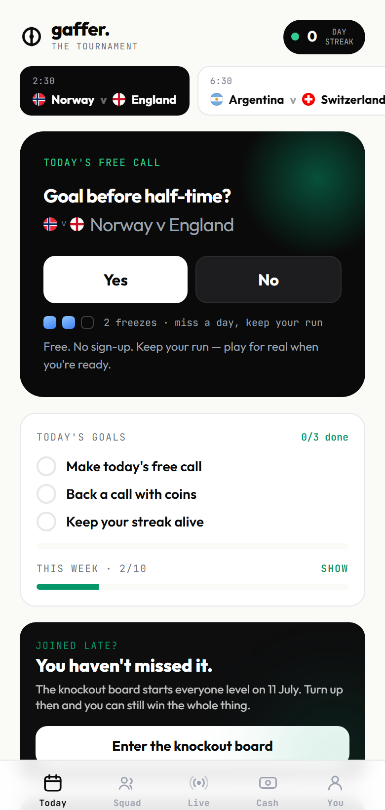
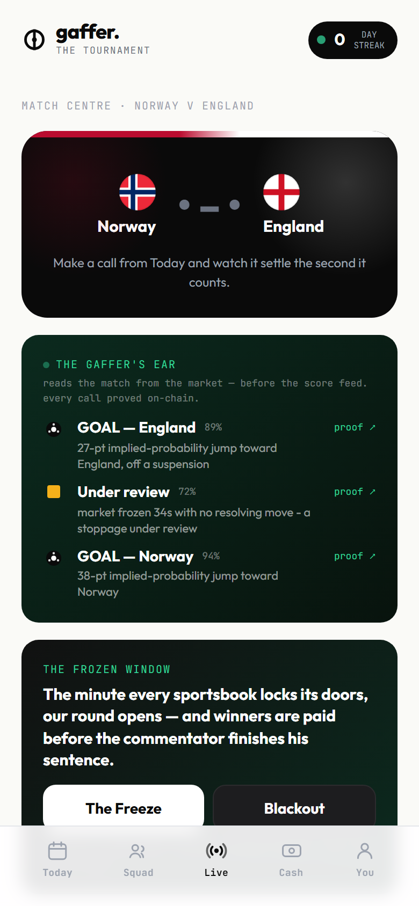

<div align="center">

# ⚽ GAFFER

### The World Cup, turned into a game you play with your mates — and the payout is one no one can refuse.

[](https://gaffer-cyan.vercel.app)


Call what happens on the pitch, together, in real time. Win, and the pot pays you the moment the match proves you right — from a pool with no house in it, so no one can void it, limit you, or stall your payout. Ever.

Built on **[TxLINE](https://txodds.com)** live World Cup data · settled trustlessly on **Solana** · three tracks: Consumer · Prediction Markets & Settlement · Trading Tools & Agents.

_Demo filmed live during a World Cup match — linked here on submission._

<table>
<tr>
<td></td>
<td></td>
</tr>
<tr>
<td align="center"><sub><b>The matchday lobby</b> — a call, the market read, live pools</sub></td>
<td align="center"><sub><b>The Gaffer's Ear</b> — goals & stoppages read from the market, each proved on-chain</sub></td>
</tr>
</table>

</div>

---

## 💡 The idea in 30 seconds

Every sports app makes you a customer of a house that profits when you lose — and the top complaint across the entire category isn't the odds, it's *"they won't pay me."* Trustpilot scores of 1.3–1.9★ sit next to 4.5★ App Store ratings for the same apps. The gap is the whole opportunity.

GAFFER removes the house entirely. Calls go into a **parimutuel pool**: everyone who's right splits the pot in proportion to their stake, and the result itself releases the money — verified against official match data, on-chain, with no operator in the loop who *can* refuse you. You feel it as: *you called it → you got paid → here's the proof.*

No jargon, no seed phrases, no token. It should feel like your group chat got a scoreboard and a wallet.

## 🔒 Why no one can rig the payout

Most on-chain prediction markets settle the same way underneath: an operator — an admin, or a keeper — reads the match result and *posts it* to the contract. The contract takes their word for it. You are trusting that one party to post the truth, and to not pause, void, or delay when the truth is expensive.

GAFFER doesn't work that way. Settlement is a CPI into TxLINE's on-chain `validate_stat`, which **re-verifies the cryptographic proof against TxODDS's anchored Merkle root inside the settle transaction itself**. The kernel pays only on a `true` verdict it checked with its own eyes.

- **The settler cannot lie.** Cranking is permissionless — anyone can settle any pool — precisely because a wrong or forged proof just fails the transaction. There is no privileged party who *could* post a false result.
- **No operator can refuse you.** The pool has no pause button and no custodian. The result releases the money; the code is the only counterparty.
- **Every payout is checkable.** The settle signature is on Explorer, and the proof it verified is the same signed feed TxODDS publishes.

That is the real answer to the Settlement track: not "we settle on live data," but *no human is trusted to settle at all.*

## ▶️ Play it in 60 seconds

1. Open **[gaffer-cyan.vercel.app](https://gaffer-cyan.vercel.app)** — no sign-up, no install.
2. **Today** → lock in the free daily call (your streak starts).
3. **Cash → Add funds** — tops up your in-app balance with **free devnet play-coins** (a faucet, not a purchase).
4. Back a pool (*"USA to score?"*), watch the projected payout move as others take the other side.
5. **Cash → Your calls → Collect** — the pool settles on the real result and pays you out, with a Proof-of-Payout receipt.
6. **Live → The Freeze** → the signature synchronized round that opens the minute every sportsbook locks its doors.

> **On money:** GAFFER runs today on **valueless devnet play-currency** — it's a free-to-play skill-and-social game, not real-money wagering. The innovation being demonstrated is the *payout technology*: instant, non-custodial, un-clawback, and provable. The path to real-money rails is real, but nothing of value is staked in this build.

## 📦 What's in the box

| Layer | What it is |
|---|---|
| **LATCH kernel** | An Anchor (Solana) program: non-custodial parimutuel pools + N-leg parlays, settled by a CPI into TxLINE's on-chain `validate_stat`. Pays the winning side pro-rata; refunds automatically if a match is called off. **`lock_ts` closes the oracle-latency exploit** — no call can land after the cut-off. |
| **Commercial floor** | A capped (5%), currently-**0** protocol rake on winnings-only, living in a singleton on-chain config PDA. The app's fee line and revenue screen read the live number straight from chain — a verifiable, flip-a-switch revenue path, not a slide. |
| **The Frozen Window** | The signature real-time round. When the live market goes quiet mid-match — the odds stop ticking on a VAR check or a decisive moment, the instant every book freezes — GAFFER auto-opens a synchronized flash round: 20s to call what happens next, the room fills live, a Verdict Brief on settle, a web-push ping to your whole squad the same second. It settles on the real goal-count delta from the signed feed. |
| **The Receipt** | Every win fires a Proof-of-Payout card stamped with the odds you called it at (e.g. "Called at 23% · paid 2.50×"), a buried on-chain proof link, and a shareable branded OG image. |
| **The Gaffer's Ear** ⚡ | The flagship autonomous agent — it reads the *match* from the *market*. When a team scores, its win-probability doesn't drift, it lurches (a real book went 2.00 → 1.04 the instant a goal went in); a VAR check suspends the line; the whistle closes it. So the Ear infers **goals (with the scoring side), stoppages and full-time from the live odds alone** — the one thing the feed streams live — and calls each event *before* the score feed, which only finalises post-match. Every call is committed on-chain the moment it's made (a Memo whose block time proves *we knew first*), shown live in the app with a proof link, and graded after full-time against the signed feed. No other entry in the field reads events from the market; everyone else stops at "a move happened." |
| **The Gaffer's Take & Read** | Two more AI surfaces on the real feed. **The Take** (NVIDIA NIM) reacts to match moments with a one-line pundit's hot take and one-tap voice. **The Read** explains a live move in the de-margined market ("the line just jumped 12 points onto Spain — the sharp money's committing"), reading the market only, never claiming an event it hasn't seen. Both never go blank. |
| **Autonomous agents (Track 3)** | **Seven** unattended agents run 24/7 on a deployed host, reading the signed TxLINE feed: **the Ear** (events from the market), the **keeper** (settles pools on-chain), a **sharp-move detector**, an in-play **market-maker** (quotes, pulls on a decisive move), a **CLV tracker**, an **agent-vs-agent arena** (favourite vs underdog, settled by the real result), and **the Read** analyst. Deterministic cores (each has a `--selftest`), kept JSONL logs, and a supervisor that discovers fixtures itself and restarts any that crash. No secrets on the box — they call the deployed API. |
| **Keeper** | The settling agent, and the sharp end of the trustless design: it discovers the anchored proof for an open pool and settles it with no human in the loop. Settlement is permissionless — the kernel re-verifies the proof, so anyone can crank and **no one can settle a pool wrongly.** |
| **Web app** | Next.js 16 **installable PWA** — Today / Live / Slip / Squad / Nations / Cash / You. Server-authoritative points on Postgres, browser-signed on-chain calls, web push (VAPID), 18+ gate, mute-money + spoiler-safe modes, felt-not-shown copy throughout. |
| **Data** | TxLINE live scores + consensus-odds + fixture streams, proxied server-side so credentials never touch the browser. |

### Architecture

```
 Fan (PWA)  ──calls, signed in-browser──►  LATCH kernel (Solana)  ──CPI──►  TxLINE validate_stat
     │                                            ▲                              (official match data,
     │  points / squads / streaks                 │  settle / claim               anchored on-chain)
     ▼                                            │
 Next.js API ──► Postgres (server-authoritative)  Keeper (autonomous settle)
```

## ✅ Proof it works

- **Kernel test suite: 39/39 passing on devnet** — pro-rata payout to the lamport, empty-side→refund, `void()` both-sides refund, `settle_no` (proving a stat *never* crossed its line), parlay all-legs-hit sweep, parlay bust→NO, `lock_ts` late-call rejection, the **capped rake** (exact fee split + cap + authority guards), and every settlement-binding negative (fixture/stat/binary/expiry/comparison). Run: `npm run test:kernel`.
- **Goal → on-chain payout in ~4 seconds — measured against a real World Cup goal.** On USA 2–0 Bosnia, a pool on "USA to score twice" settles the moment the signed data is available: three runs at **3.8 / 4.1 / 4.9 s** from proof to confirmed on-chain payout, the winner paid each time, every settle signature verified on devnet (`err: null`). A live match adds only TxODDS's ~5-min root-anchor cadence on top — their floor, not ours. Run: `cd web && npm run measure:settle`.
- **The full stake → settle → PAID loop, proven on-chain** — a fresh wallet stakes YES on a finished, anchored fixture, the pool settles permissionlessly on the real TxLINE proof (`provenValue: 2`), and the claim pays out a profit — receipt signature on Explorer.
- **Seven agents live 24/7** on a DigitalOcean host, discovering fixtures themselves and reading the signed feed — **the Ear** (events inferred from the market, committed on-chain), the keeper, sharp-move detector, market-maker, CLV tracker, arena, and the Read analyst — with kept logs (`agents/`, `deploy/`). The Ear's on-chain proof: a Memo like `GAFFER-EAR|18172379|goal|home|91|…` lands on devnet the instant it calls, verifiable by block time.
- **The Frozen Window, load-tested** — 24 concurrent callers into one round, zero failures, correct tally, settled on the real goal-count delta.
- **Deployed and playable** at the live URL above, backed by hosted Postgres and a dedicated RPC.

> **On the live feed, honestly:** TxODDS's devnet feed streams **odds in-running** (the market is genuinely live — prices move to the second), but it does **not** stream live *score events* — the score stream fills in only once a match is finalised. So the live surfaces run on the live odds (the market read, the Drama Meter, the Blackout that arms off real market silence), and score-settled pools settle on the signed score data once it's anchored. Nothing fabricates a scoreline it can't prove.

## 🛠️ Run it yourself

**Kernel + scripts** (`/`, Node + ts-node):
```bash
npm install
npm run test:kernel     # 39-case devnet suite (needs ~2 devnet SOL on .devnet-key.json)
npm run e2e:kernel      # single-market stake → settle → claim, end to end
npm run keeper          # autonomous settler loop
```

**Web app** (`/web`, Next.js 16):
```bash
cd web
cp .env.example .env.local   # fill DATABASE_URL, GAFFER_KEYPAIR_SECRET, RPC
npm install
npm run dev                  # http://localhost:3000
```

**Autonomous agents** (`/agents`, no deps — they call the deployed API):
```bash
# run the whole suite against the live slate (discovers fixtures itself)
GAFFER_API=https://gaffer-cyan.vercel.app node agents/worker.mjs
# or the flagship Ear on one match — reads events from the market, live
GAFFER_API=https://gaffer-cyan.vercel.app node agents/ear.mjs 18213979
# after full-time, grade the Ear against the signed feed
GAFFER_API=https://gaffer-cyan.vercel.app node agents/ear.mjs --score 18213979
```
`deploy/` provisions these on a DigitalOcean droplet under systemd (`Restart=always`) — see `deploy/README.md`.

## ⛓️ On-chain facts

- **LATCH program (devnet):** `HBJKUPdL4g1K7jpJdPMACMDK6nhPc44gd8RaPtHgwhcG`
- **TxLINE oracle (devnet):** `6pW64gN1s2uqjHkn1unFeEjAwJkPGHoppGvS715wyP2J` — `validate_stat` returns a verified verdict the kernel reads before it pays.
- Devnet throughout today; the kernel is chain-agnostic and flips to mainnet the moment TxLINE settlement is live there.

## 🚀 Where it's going

Real-money rails (fiat on-ramp, felt-like-Venmo cash-out), Telegram mini-app + Farcaster frame on the same backend, the synchronized-squad live rounds ("the minute every sportsbook locks its doors, our round starts"), and season-two beyond the World Cup — the kernel generalizes to any competition TxLINE carries.

## 📄 License

[MIT](./LICENSE).
